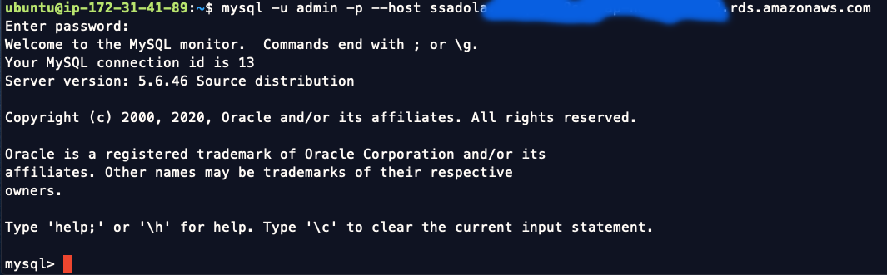
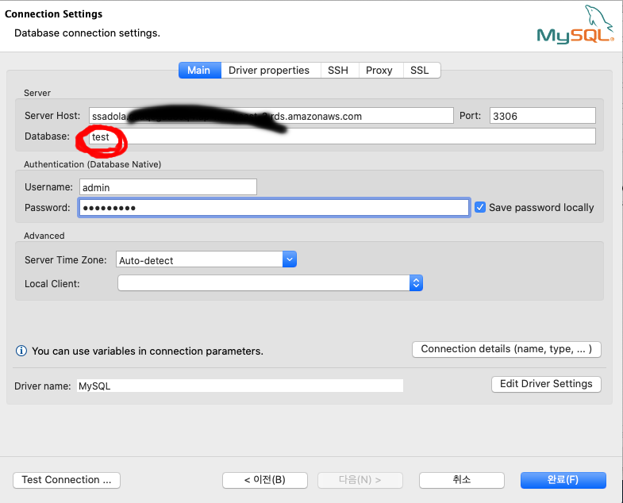

## AWS EC2 - RDS 접속하기

```
RDS 엔드 포인트 ssadola.****.rds.amazonaws.com

Server public ip
13.124.83.**


db 관리자 계정 admin/****
```

1. EC2 접속

키 페어(aws_key.pem) 필요!!!

Linux / Mac OS
> $ ssh -i aws_key.pem ubuntu@13.124.83.**

Windows 
참고 
<https://supdev.tistory.com/22>  
<https://mozi.tistory.com/191>

EC2 접속 후

2. RDS(MySQL) 접속 - CLI

EC2 서버가 우분투라서 우분투 명령어 써야해요.

> $ mysql -u admin -p --host ssadola.caaqegau8sq4.ap-northeast-2.rds.amazonaws.com

이 명령어를 치면 mysql DB에 로그인 시도

비밀번호 : ****

로그인 성공
  

3. RDS 접속 - GUI by Dbeaver

**디비버**라는 툴로 디비 관리 가능함.  
[다운로드](https://dbeaver.io/download/)  

RDS 엔드 포인트와 계정 admin/**** 필요 
**데이터베이스명 : test**  
*미안해요..생성하다가..디비명을..test로 해버렸어요..미안해요*
  

RDS와 연결 후  

참고   
<https://mia15.tistory.com/entry/AWS-RDS-%EC%83%9D%EC%84%B1%EB%B6%80%ED%84%B0-%EC%97%B0%EA%B2%B0%EA%B9%8C%EC%A7%80>
